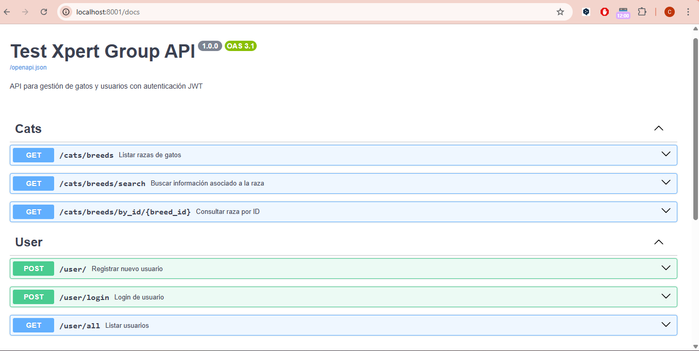
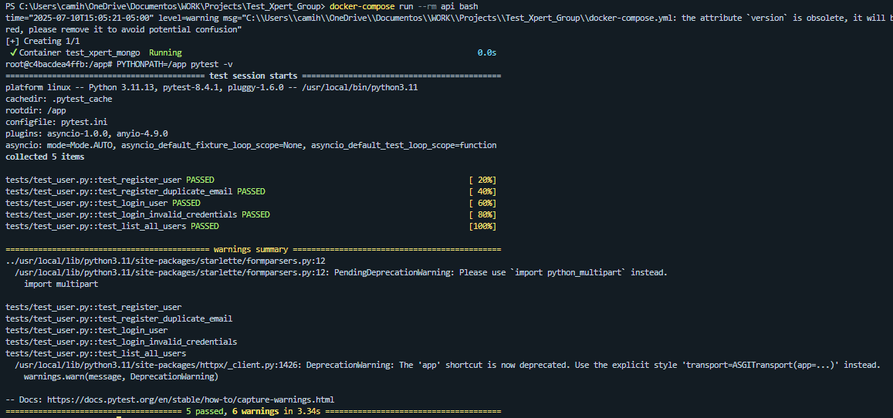

# 🧪 Test Xpert - Backend API

Sistema backend desarrollado con **FastAPI**, **MongoDB** y **Docker**, diseñado bajo principios de **Clean Architecture**. Esta API forma parte de una prueba técnica y contiene autenticación JWT, conexión a TheCatAPI y pruebas unitarias con Pytest.

---

## 🛠️ Tecnologías

* 🐍 Python 3.11
* ⚡ FastAPI
* 🧬 MongoDB (Motor)
* 🐳 Docker & Docker Compose
* 🔐 JWT Auth (via `pyjwt`)
* 📦 TheCatAPI (integración externa)
* ✅ Pytest + pytest-asyncio
* 🔧 Clean Architecture

---

## 🚀 Cómo iniciar el proyecto

### 🐋 Usando Docker

```bash
docker-compose up --build
```

Accede a la API Swagger en: [http://localhost:8001/docs](http://localhost:8001/docs)



---

## 🔐 Variables de entorno

Crea un archivo `.env` con el siguiente contenido:

```env
ENV=test
MONGO_URI=mongodb://mongo:27017/prod_db
TEST_MONGO_URI=mongodb://mongo:27017/test_db
JWT_SECRET=test_xpert_jwt
JWT_ALGORITHM=HS256
ACCESS_TOKEN_EXPIRE_MINUTES=30
API_BASE_URL=https://api.thecatapi.com/v1
API_KEY=tu_api_key_de_thecatapi
```

> ⚠️ Este archivo ya está en `.gitignore` para evitar filtración de credenciales.

---

## 🧚 Ejecutar pruebas

```bash
# Desde tu contenedor:
docker-compose run --rm api bash

# Luego dentro del contenedor:
PYTHONPATH=/app pytest -v



```

✔️ Cobertura completa para:

* Endpoints de usuarios
* Endpoints de raza de gatos
* Manejo de errores
* Limpieza automática entre tests
